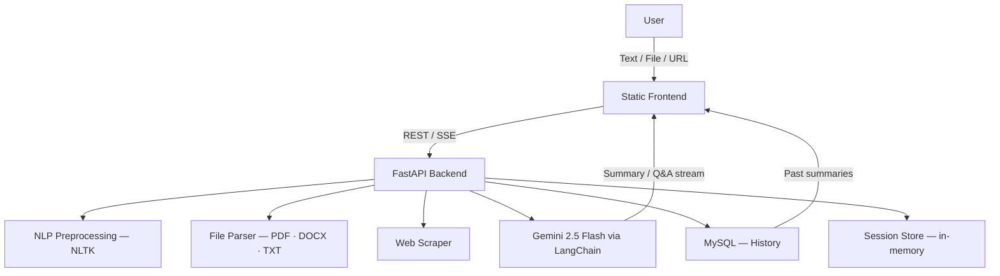

<p align="center">
  
  
  
  
  
  
</p>

<h1 align="center">SummarAI</h1>
<p align="center">
  <strong>Intelligent summarization assistant for text, files, and web pages.</strong><br/>
  Powered by Google Gemini 2.5 Flash · Built with FastAPI · Enhanced with NLP
</p>

<p align="center">
  <a href="#-features">Features</a> ·
  <a href="#-architecture">Architecture</a> ·
  <a href="#-getting-started">Getting Started</a> ·
  <a href="#-api-reference">API Reference</a> ·
  <a href="#-roadmap">Roadmap</a>
</p>

---

## Overview

**SummarAI** is a production-ready content summarization engine that transforms raw text, documents, and web pages into clean, readable summaries — streamed in real time to the browser.

The stack is intentionally lean and transparent:

- **FastAPI** serves both the REST API and the static frontend from a single process
- **Google Gemini 2.5 Flash** handles generation via LangChain
- **NLTK** pre-processes input to maximize prompt quality
- **SSE (Server-Sent Events)** streams tokens progressively to the client
- A built-in **Q&A mode** lets users interrogate any summarized document

---

## ✨ Features

| Category | Details |
|----------|---------|
| **Input sources** | Plain text, PDF, DOCX, TXT, and any public URL |
| **Real-time streaming** | Tokens streamed via SSE for a responsive UX |
| **Q&A mode** | Ask follow-up questions against the source document |
| **Session management** | In-memory session store for multi-turn interactions |
| **NLP preprocessing** | Tokenization, cleaning, and prompt enrichment with NLTK |
| **History** | Optional MySQL backend for persistent summary history |
| **Static frontend** | Self-contained UI served directly by the backend |

---

## 🏗 Architecture



### Module map

```
backend/
├── main.py                     # App entry point, CORS, lifecycle, static mount
├── api/
│   └── routes.py               # REST endpoints (/summarize · /ask · /health)
├── agents/
│   └── summarizer_agent.py     # Orchestration: summarization & Q&A logic
├── services/
│   ├── gemini_service.py       # Gemini / LangChain wrapper
│   └── history_service.py      # Summary storage & retrieval
├── preprocessing/
│   └── nltk_processor.py       # Text cleaning, tokenization, prompt data
├── prompts/
│   └── style_prompts.py        # Prompt templates per summary style
├── tools/
│   ├── file_parser.py          # PDF · DOCX · TXT extraction
│   └── web_scraper.py          # HTML fetch & clean
├── memory/
│   └── session_store.py        # Session & current-document store for Q&A
├── config/
│   └── settings.py             # Pydantic settings / env loader
└── static/
    └── index.html              # Single-page frontend
```

---

## 🚀 Getting Started

### Prerequisites

- Python 3.10+
- pip
- *(Optional)* MySQL 8+ for persistent history

### Installation

```bash
# 1. Clone the repository
git clone https://github.com/your-username/SummarAI.git
cd SummarAI

# 2. Create and activate a virtual environment
python -m venv .venv
source .venv/bin/activate        # macOS / Linux
# .\.venv\Scripts\activate       # Windows PowerShell

# 3. Install dependencies
pip install -r backend/requirements.txt
```

### Configuration

Create a `.env` file inside `backend/` and fill in the values below:

```env
# ── Gemini ────────────────────────────────────────────────
GEMINI_API_KEY=your_api_key_here
GEMINI_MODEL=gemini-2.5-flash
GEMINI_TEMPERATURE=0.3
GEMINI_MAX_TOKENS=2048

# ── MySQL (optional — app runs without it) ────────────────
MYSQL_HOST=localhost
MYSQL_PORT=3306
MYSQL_USER=root
MYSQL_PASSWORD=your_password
MYSQL_DATABASE=ai_summarizer

# ── Server ────────────────────────────────────────────────
HOST=0.0.0.0
PORT=8000
DEBUG=True
ALLOWED_ORIGINS=["*"]
```

> **Security note:** never commit your `GEMINI_API_KEY`. The `.gitignore` already excludes `.env`.

### Running

```bash
cd backend
python main.py
```

| URL | Description |
|-----|-------------|
| `http://localhost:8000` | Web UI |
| `http://localhost:8000/docs` | Interactive Swagger docs |
| `http://localhost:8000/redoc` | ReDoc API reference |

---

## 📡 API Reference

### `POST /api/v1/summarize`

Accepts text, a file, or a URL and returns a generated summary. Supports SSE streaming.

**JSON body (text source)**
```json
{
  "source": "text",
  "content": "The content you want to summarize."
}
```

**Multipart form (file source)**
```bash
curl -X POST http://localhost:8000/api/v1/summarize \
     -F "file=@report.pdf"
```

**Python example**
```python
import requests

with open("report.pdf", "rb") as f:
    response = requests.post(
        "http://localhost:8000/api/v1/summarize",
        files={"file": f}
    )
print(response.json())
```

---

### `POST /api/v1/ask`

Ask a follow-up question against a previously summarized document.

```bash
curl -X POST http://localhost:8000/api/v1/ask \
     -H "Content-Type: application/json" \
     -d '{"session_id": "<SESSION_ID>", "question": "What is the main argument?"}'
```

---

### `GET /api/v1/health`

Liveness check — returns `200 OK` when the service is up.

---


## 🔒 Security & Best Practices

- Set `DEBUG=False` in any non-development environment
- Restrict `ALLOWED_ORIGINS` to your actual domains in production
- Rotate your Gemini API key regularly and use scoped service accounts where possible
- Enforce document size limits to stay within Gemini token quotas
- Add network-level timeouts on outbound Gemini API calls

---

## 📦 Tech Stack

| Layer | Technology |
|-------|-----------|
| API framework | FastAPI 0.111 |
| LLM | Google Gemini 2.5 Flash |
| LLM orchestration | LangChain 0.2 |
| NLP preprocessing | NLTK 3.8 |
| File parsing | PyMuPDF · python-docx |
| Web scraping | httpx · BeautifulSoup4 |
| Settings management | pydantic-settings |
| Database (optional) | MySQL 8 |

---

## 📄 License

Distributed under the **MIT License**. See [`LICENSE`](LICENSE) for details.

---
